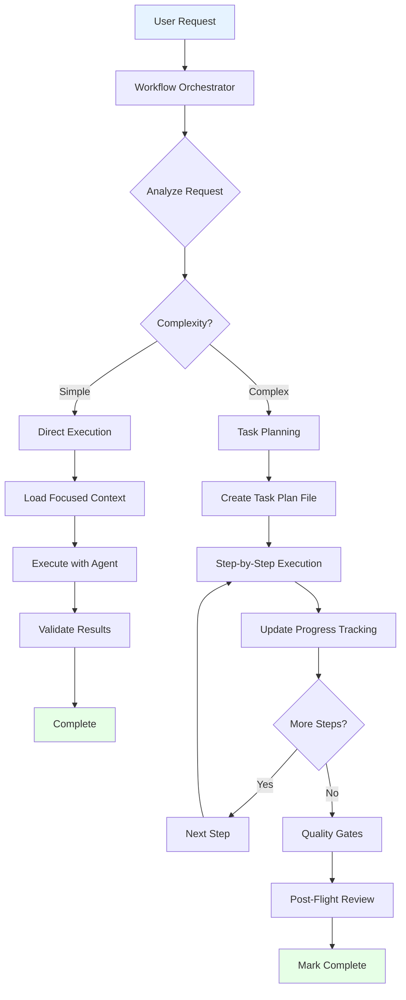
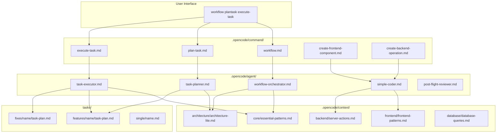

# The OpenCode Agent System Blueprint

_Build Intelligent Workflow Systems with Context-Aware AI_

---

## ⚡ TL;DR - Quick Reference

**For New Users:**
- Start with `opencode --agent codebase-agent` for all development work
- The agent handles planning, implementation, testing, and review automatically
- Add your coding patterns to `.opencode/context/project/project-context.md`
- Let the agent delegate to specialized subagents when needed

**For Advanced Users:**
- Read this document to understand how to create custom agents and commands
- Learn how context loading works (the `@` symbol)
- Extend the system with domain-specific context files
- Build specialized workflows for repeated patterns

**Core Concept:**
```
Commands load context → Agents execute with that context → Subagents handle specialized tasks
```

**When to read this document:**
- ✅ You want to create custom agents or commands
- ✅ You need to understand how context loading works
- ✅ You want to extend the system for your specific needs
- ❌ You just want to start building (use `codebase-agent` instead)

---

## 🎯 About This Document

This blueprint is a **teaching document** that explains agent system architecture patterns. It uses examples to teach concepts like context loading, agent orchestration, and workflow management.

> **📖 Installation & Usage:** See [README.md](../../README.md) in the repository root.

### What You'll Learn

This document teaches:
- ✅ How context loading works (the `@` symbol magic)
- ✅ Agent architecture and role separation
- ✅ Workflow orchestration patterns
- ✅ How to extend the system with custom agents/commands
- ✅ How to add domain-specific context files

### Understanding Examples in This Document

**When you see commands like `/workflow`, `/plan-task`, `/create-frontend-component`:**
- These are **pattern examples** showing how you COULD structure commands
- Most aren't implemented in the repository
- The existing `codebase-agent` already handles these workflows
- Create them only if you have specific repeated patterns

**When you see extensive context hierarchies:**
- The repository includes `core/` and `project/` context files
- Add domain-specific files (`frontend/`, `backend/`, `database/`) as needed
- Start simple, expand based on your needs

**When you see task management structures:**
- The `task-manager` agent creates `tasks/` directories automatically
- No need to pre-create structures

### The Working System

The repository provides a complete working system:

```bash
# This works right now:
opencode --agent codebase-agent
> "Create a user authentication system"

# The agent will:
# 1. Plan implementation
# 2. Ask for approval
# 3. Delegate to @task-manager for complex features
# 4. Use @tester for tests
# 5. Use @reviewer for security
```

---

## The Golden Rule

**Context flows in one direction: Commands load context immediately, Agents can look up additional context deterministically.**

Like a well-organized library: the librarian (command) brings you the right books immediately, but you (agent) can look up specific references when needed.

## How @ Symbol Context Loading Works (FUNDAMENTAL)

### The Magic of Automatic Context Injection

When you create a slash command with @ references, OpenCode automatically loads that context into the agent's memory BEFORE the agent starts thinking:

```markdown
# .opencode/command/create-component.md

---

name: create-component
agent: simple-coder

---

You are creating React components following our patterns.

**Request:** $ARGUMENTS

@.opencode/context/frontend/react-patterns.md
@.opencode/context/styling/design-system.md
@.opencode/context/core/validation-patterns.md

Create the component now.
```

**What happens when user types `/create-component "user profile card"`:**

1. ✅ OpenCode reads the command file
2. ✅ **Automatically loads** react-patterns.md, design-system.md, validation-patterns.md
3. ✅ **Injects all context** into the agent's working memory
4. ✅ Agent receives: user request + all loaded context + instructions
5. ✅ Agent can immediately use patterns without looking them up

### Why This Mechanism Is Powerful

**❌ Without @ loading:**

```
Agent: "I need to create a component but don't know your patterns. Let me search..."
→ Agent uses generic patterns or has to look up files
→ Inconsistent results, slower execution
```

**✅ With @ loading:**

```
Agent: "I have your React patterns, design system, and validation rules loaded. Creating component..."
→ Agent immediately follows your exact patterns
→ Consistent, fast, high-quality results
```

### Context Loading Strategy

**Base Context (Always Load):**

```markdown
@.opencode/context/core/essential-patterns.md
@.opencode/context/architecture/project-structure.md
```

**Domain-Specific Context (Load Based on Command Purpose):**

```markdown
# Frontend commands

@.opencode/context/frontend/react-patterns.md
@.opencode/context/styling/design-system.md

# Backend commands

@.opencode/context/backend/server-patterns.md
@.opencode/context/database/query-patterns.md

# Testing commands

@.opencode/context/testing/test-patterns.md
```

### Dynamic Context Loading

```markdown
# Advanced: Conditional context based on request analysis

@.opencode/context/core/essential-patterns.md
!`if echo "$ARGUMENTS" | grep -i "component\|ui" > /dev/null; then echo "@.opencode/context/frontend/react-patterns.md"; fi`
!`if echo "$ARGUMENTS" | grep -i "database\|query" > /dev/null; then echo "@.opencode/context/database/query-patterns.md"; fi`
```

### Best Practices for @ Context Loading

1. **Load 2-4 context files maximum** (prevent cognitive overload)
2. **Always include core patterns** (essential-patterns.md)
3. **Load domain-specific patterns** based on command purpose
4. **Keep context files focused** (50-150 lines each)
5. **Use conditional loading** for dynamic context selection

### Why This Architecture Matters

Understanding @ symbol auto-loading is crucial because:

- **It's the foundation** of how agents get consistent context
- **It determines command design** - you must anticipate what context agents need
- **It explains the architecture** - why commands are "smart loaders" and agents are "focused executors"
- **It guides best practices** - load the right context, not too much, not too little

**This mechanism is what makes the system "intelligent" - agents always start with the right knowledge instead of having to discover it.**

## Core Principles

### 1. Single-Level Context Loading

**OpenCode processes `@` references only in command templates, NOT recursively in file contents.**

```markdown
# ✅ This works (in command template)

@.opencode/context/frontend/patterns.md
@.opencode/context/styling/design-system.md

# ❌ This doesn't work (inside patterns.md file)

# If patterns.md contains @other-file.md, it's treated as plain text
```

**Critical Implication**: Commands must load ALL necessary context upfront using @ references. Agents can look up additional files using tools (read, grep, glob), but cannot use @ loading themselves.

### 2. Deterministic vs Non-Deterministic Behavior

- **Commands**: Non-deterministic - analyze requests and load appropriate context
- **Agents**: Deterministic - predictable behavior, can look up additional context

### 3. Context Optimization

- **Maximum 4 context files per command** (250-450 lines total)
- **50-150 lines per context file** (optimal range)
- **Always load core patterns** + request-specific context

## The 5-Part Intelligent System

### 1. Commands (.opencode/command/)

**What:** Entry points that load immediate context based on request analysis
**Rule:** Commands are non-deterministic - they adapt context to the request

```
/workflow                    → Intelligent routing with dynamic context
/plan-task                   → Task planning with architecture context
/execute-task               → Step execution with progress tracking
/create-frontend-component  → UI development with styling + frontend context
/create-backend-operation   → Server logic with backend + database context
/create-database-operation  → Database queries with focused database context
/review-completion          → Quality assurance with minimal context
/validate-with-tests        → Automated testing with testing context
```

**Command Structure Pattern:**

```markdown
---
name: command-name
agent: target-agent
description: "What this command does"
---

You are [doing specific task]. [Direct instructions to agent].

**Request:** $ARGUMENTS

**Your Instructions:**

1. **ANALYZE** the request...
2. **IMPLEMENT** following patterns...
3. **VALIDATE** the results...

**Context Loaded:**
@.opencode/context/core/essential-patterns.md
@.opencode/context/[domain]/[specific-patterns].md
@.opencode/context/architecture/architecture-lite.md

**Success Criteria:**

- [Specific measurable outcomes]

Execute this [task type] now.
```

### 2. Agents (.opencode/agent/)

**What:** Deterministic AI workers with specific capabilities
**Rule:** Agents can look up additional context but are predictable in behavior

```
Primary Agents:
├── workflow-orchestrator.md  → Routes requests and analyzes complexity
├── task-planner.md           → Creates detailed task plans with file tracking
├── task-executor.md          → Executes planned steps systematically
├── post-flight-reviewer.md   → Reviews completed work for compliance
└── simple-coder.md           → Implements focused development tasks

Subagents (Specialized):
├── subagents/code-reviewer.md    → Security and quality reviews (read-only)
├── subagents/test-writer.md      → Test creation and validation (reports issues)
├── subagents/pattern-finder.md   → Discovers existing implementations
└── subagents/doc-writer.md       → Documentation creation and updates
```

**Agent Structure Pattern:**

```markdown
---
description: "What this agent does"
mode: primary|subagent
model: claude-4-sonnet
temperature: 0.1-0.3
tools:
  read: true|false
  edit: true|false
  write: true|false
  bash: true|false
  task: true|false
permissions:
  edit:
    "**/*.env*": "deny"
    "**/*.secret": "deny"
---

You are [specific role]. [Direct instructions for behavior].

**EXECUTE** this [process type] for every [task type]:

**1. [ACTION]** the [subject]:

- [Specific instruction 1]
- [Specific instruction 2]

**2. [ACTION]** the [subject]:

- [Specific instruction 1]
- [Specific instruction 2]

**RULES**:

- **ALWAYS** [critical requirement]
- **NEVER** [forbidden action]
- **ONLY** [scope limitation]

Execute [task type] now.
```

### 3. Context (.opencode/context/)

**What:** Layered knowledge system with focused domains
**Rule:** Single-level loading - no recursive context references

```
context/
├── core/
│   └── essential-patterns.md    (76 lines - always loaded)
├── architecture/
│   └── architecture-lite.md     (74 lines - project structure)
├── frontend/
│   ├── frontend-patterns.md     (230 lines - React patterns)
│   └── styling/design-system.md (122 lines - UI standards)
├── backend/
│   ├── backend-patterns.md      (326 lines → split into focused files)
│   └── server-actions.md        (100 lines - focused server action patterns)
├── database/
│   └── database-queries.md      (207 lines - query patterns)
├── security/
│   └── security-patterns.md     (205 lines - auth patterns)
├── testing/
│   ├── testing-patterns.md      (322 lines → split)
│   └── unit-testing.md          (100 lines - focused test patterns)
└── debugging/
    └── common-errors.md          (304 lines → split by error type)
```

**Context File Structure Pattern:**

````markdown
**[ACTION]** [subject] using these exact patterns:

**[PATTERN NAME]** - [When to use]:

```[language]
// Example code with clear comments
// Showing exactly what to do
```
````

**[ANOTHER PATTERN]** - [When to use]:

```[language]
// Another example
```

**RULES**:

- **ALWAYS** [critical requirement]
- **NEVER** [forbidden action]
- **USE** [specific tools/methods]

```

### 4. Task Management (tasks/)
**What:** File-based progress tracking with checkbox systems
**Rule:** Every complex task gets a plan file with step-by-step tracking

```

tasks/
├── features/ # Feature development
│ └── [feature-name]/
│ ├── task-plan.md # Main plan with checkboxes
│ ├── execution-log.md # Detailed progress log
│ └── review-report.md # Post-flight review
├── fixes/ # Bug fixes
│ └── [issue-name]/
│ ├── task-plan.md
│ └── fix-report.md
├── improvements/ # Code improvements
│ └── [improvement-name]/
└── single/ # Simple tasks
└── [task-name].md

````

**Task Plan File Structure:**
```markdown
# Task: [Task Name]

## Overview
**Request**: [Original user request]
**Complexity**: [Simple/Medium/Complex]
**Estimated Duration**: [Time estimate]
**Dependencies**: [List any blocking requirements]

## Task Breakdown

### Phase 1: [Phase Name]
- [ ] **Step 1.1**: [Specific action]
  - **Agent**: @[agent-name]
  - **Context**: [Required context files]
  - **Validation**: [How to verify completion]
  - **Duration**: [Time estimate]

- [ ] **Step 1.2**: [Specific action]
  - **Agent**: @[agent-name]
  - **Context**: [Required context files]
  - **Validation**: [How to verify completion]
  - **Duration**: [Time estimate]

## Quality Gates
- [ ] **Build Validation**: TypeScript compilation passes
- [ ] **Code Review**: Security and quality review completed
- [ ] **Testing**: All tests pass and coverage adequate
- [ ] **Integration**: Feature works end-to-end

## Acceptance Criteria
- [ ] [Specific requirement 1]
- [ ] [Specific requirement 2]

## Progress Tracking
**Started**: [Date/Time]
**Last Updated**: [Date/Time]
**Status**: [Planning/In Progress/Review/Complete]
**Completed Steps**: 0/[Total Steps]
````

### 5. Workflow Orchestration

**What:** Multi-agent coordination with quality gates
**Rule:** Complex workflows use multiple agents with validation checkpoints

```
Workflow Types:
├── Simple (< 30 min)     → Direct execution with focused context
├── Medium (30min-2hrs)   → Task planning with step tracking
└── Complex (> 2hrs)      → Multi-phase with quality gates

Quality Gates:
├── Build Validation      → TypeScript, linting, build checks
├── Code Review          → Security and quality assessment
├── Testing              → Automated test execution
└── Post-Flight Review   → Instruction compliance verification
```

## System Flow (Intelligent Workflow Management)



## Context Loading Strategy

### Dynamic Context Loading Pattern

```markdown
# In workflow orchestrator

**ANALYZE** request: "$ARGUMENTS"

**BASE CONTEXT** (always loaded):
@.opencode/context/core/essential-patterns.md
@.opencode/context/architecture/architecture-lite.md

**CONDITIONAL CONTEXT** (based on request analysis):
!`if echo "$ARGUMENTS" | grep -i -E "(component|ui|frontend)" > /dev/null; then echo "@.opencode/context/styling/design-system.md"; fi`
!`if echo "$ARGUMENTS" | grep -i -E "(server|backend|action)" > /dev/null; then echo "@.opencode/context/backend/server-actions.md"; fi`
!`if echo "$ARGUMENTS" | grep -i -E "(database|query|data)" > /dev/null; then echo "@.opencode/context/database/database-queries.md"; fi`
```

### Context Size Guidelines

- **✅ Optimal**: 50-150 lines (focused, actionable patterns)
- **⚠️ Acceptable**: 150-250 lines (comprehensive but manageable)
- **❌ Too Large**: 250+ lines (should be split into focused files)

### Context Loading Rules

1. **Always load core patterns** (essential-patterns.md + architecture-lite.md)
2. **Maximum 4 context files** per command (prevent overload)
3. **Load based on request analysis** (dynamic, not static)
4. **Use bash commands** for conditional loading

## Implementation Guide

### Step 1: Create Your Workflow Commands

```markdown
# Essential Commands to Create:

/workflow # Main entry with intelligent routing
/plan-task # Complex task breakdown
/execute-task # Step-by-step execution
/create-frontend-component # UI development
/create-backend-operation # Server logic
/review-completion # Quality assurance
```

### Step 2: Build Your Agent System

```markdown
# Core Agents Needed:

workflow-orchestrator.md # Request analysis and routing
task-planner.md # Detailed planning with file tracking
task-executor.md # Step execution with progress updates
post-flight-reviewer.md # Compliance and quality review
simple-coder.md # Focused implementation work

# Specialized Subagents:

subagents/code-reviewer.md # Security and quality (read-only)
subagents/test-writer.md # Test creation (reports issues)
```

### Step 3: Structure Your Context

```markdown
# Context Organization:

core/essential-patterns.md # Always loaded (76 lines)
architecture/architecture-lite.md # Project structure (74 lines)
frontend/frontend-patterns.md # React patterns (230 lines)
styling/design-system.md # UI standards (122 lines)
backend/server-actions.md # Server patterns (100 lines)
database/database-queries.md # Query patterns (207 lines)
```

### Step 4: Implement Task Management

```markdown
# Task File Structure:

tasks/features/[name]/task-plan.md # Main planning file
tasks/features/[name]/review-report.md # Post-completion review
tasks/fixes/[name]/task-plan.md # Bug fix planning
tasks/single/[name].md # Simple tasks
```

### Step 5: Add Quality Gates

```markdown
# Automated Validation:

!`pnpm tsc --noEmit` # TypeScript check
!`pnpm lint` # Code quality
!`pnpm build` # Build validation
!`pnpm test` # Test execution
```

## Best Practices

### Context Management

1. **Keep context files focused** (50-150 lines)
2. **Use single-level loading** (no recursive `@` references)
3. **Load dynamically** based on request analysis
4. **Always include core patterns** + architecture

### Agent Design

1. **Make agents deterministic** (predictable behavior)
2. **Give clear, direct instructions** (not documentation)
3. **Separate concerns** (one agent, one responsibility)
4. **Use structured response formats**

### Task Management

1. **Break complex work into steps** (15-30 minutes each)
2. **Use checkbox tracking** for progress visibility
3. **Include validation criteria** for each step
4. **Implement quality gates** at key milestones

### Workflow Orchestration

1. **Analyze before routing** (complexity and domain)
2. **Use appropriate workflows** (simple vs complex)
3. **Coordinate multiple agents** for complex tasks
4. **Validate at every step** (build, test, review)

## System Architecture



## Using the System (User Guide)

### How Slash Commands Work

**Slash commands automatically inject context into agents using @ references:**

```bash
# User types this:
/create-component "user profile card with avatar upload"

# OpenCode automatically:
# 1. Loads the command file: .opencode/command/create-component.md
# 2. Reads all @ referenced context files
# 3. Injects context + user request into the agent
# 4. Agent starts with full knowledge of your patterns
```

### Basic Commands

- `/workflow "your request"` - Main entry point for any development task
- `/plan-task "complex feature"` - For multi-step planning
- `/execute-task` - Continue working on planned tasks

### Command Examples

- `/workflow "Create a user profile component with form validation"`
- `/create-frontend-component "Dashboard header with user menu"`
- `/review-completion` - Check completed work for quality

### When to Use Which Command

- Simple tasks (< 30 min) → `/workflow`
- Complex features → `/plan-task` then `/execute-task`
- Specialized work → `/create-frontend-component`, `/create-backend-operation`

### Why This Works Better Than Chat

- **Consistent patterns**: Agents always use YOUR coding standards
- **Faster execution**: No time spent discovering or asking about patterns
- **Quality results**: Context-aware from the first response
- **Scalable knowledge**: Add new patterns once, use everywhere

## Quick Start Implementation

### 1. Start with Core System

```bash
# Create essential structure
mkdir -p .opencode/{command,agent,context/{core,architecture}}
mkdir -p tasks/{features,fixes,single}
```

### 2. Create Main Entry Point

```markdown
# .opencode/command/workflow.md

---

name: workflow
agent: workflow-orchestrator

---

You are analyzing requests and routing to optimal workflows.

**Request:** $ARGUMENTS

**Context Loaded:**
@.opencode/context/core/essential-patterns.md
@.opencode/context/architecture/architecture-lite.md

Route to appropriate specialized workflow now.
```

### 3. Build Workflow Orchestrator

```markdown
# .opencode/agent/workflow-orchestrator.md

---

description: "Routes requests to specialized workflows"
mode: primary
tools: [read, grep, glob, task]

---

You are analyzing requests and routing to specialized workflows.

**ANALYZE** the request and **ROUTE** to appropriate command:

- Feature development → /plan-task or /create-frontend-component
- Bug fixes → /fix-issue
- Code review → /review-code

Execute routing now.
```

### 4. Add Essential Context

````markdown
# .opencode/context/core/essential-patterns.md

**CORE PATTERNS** - Essential patterns for all development:

**AUTHENTICATION PATTERN**:

```typescript
const user = await getCurrentUser();
if (!user) return { error: "Unauthorized" };
```
````

**VALIDATION PATTERN**:

```typescript
const validated = schema.safeParse(data);
if (!validated.success) return { error: "Validation failed" };
```

````

### 5. Test Your System
```bash
# Test the workflow
/workflow "Create a user profile component"
# Should route to appropriate workflow with right context
````

## Remember

1. **Context flows one direction** - Commands load immediately, Agents look up deterministically
2. **Keep context focused** - 50-150 lines per file, maximum 4 files per command
3. **Make agents predictable** - Deterministic behavior with clear instructions
4. **Track everything** - File-based task management with checkbox progress
5. **Validate continuously** - Quality gates and post-flight reviews
6. **Start simple** - Build core system first, add complexity gradually

---

## Extending This System

You can extend this system by adding the example commands and agents mentioned throughout this blueprint. Here's how:

### Adding Workflow Commands (Optional)

If you want specialized commands like `/workflow` or `/create-frontend-component`:

1. **Create the command file:**
   ```bash
   # Example: .opencode/command/workflow.md
   ---
   name: workflow
   agent: workflow-orchestrator
   ---
   
   You are analyzing requests and routing to optimal workflows.
   
   **Request:** $ARGUMENTS
   
   @.opencode/context/core/essential-patterns.md
   @.opencode/context/project/project-context.md
   
   Route to appropriate agent or handle directly.
   ```

2. **Or just use `codebase-agent` directly:**
   ```bash
   opencode --agent codebase-agent
   > "Your request here"
   ```

### Adding Domain-Specific Context

Extend the context hierarchy for your tech stack:

```bash
# Create domain-specific context files
mkdir -p .opencode/context/frontend
mkdir -p .opencode/context/backend
mkdir -p .opencode/context/database

# Add your patterns
cat > .opencode/context/frontend/react-patterns.md << 'EOF'
**React Component Pattern:**
```tsx
export function MyComponent({ prop }: Props) {
  // Your pattern here
}
```
EOF
```

Then reference in your commands:
```markdown
@.opencode/context/frontend/react-patterns.md
@.opencode/context/backend/api-patterns.md
```

### Building Specialized Agents

Create domain-specific agents following the patterns:

```bash
# Example: .opencode/agent/frontend-specialist.md
---
description: "React frontend development specialist"
mode: primary
tools: [read, edit, write, bash]
---

You are a React frontend specialist.

**ANALYZE** the request and create components following patterns:
@.opencode/context/frontend/react-patterns.md

Execute implementation now.
```

### Recommended Extensions by Project Type:

**Frontend Project:**
- Add `context/frontend/react-patterns.md`
- Add `context/styling/design-system.md`
- Create `/create-component` command
- Use `codebase-agent` with frontend context

**Backend Project:**
- Add `context/backend/api-patterns.md`
- Add `context/database/query-patterns.md`
- Create `/create-api-endpoint` command
- Use `codebase-agent` with backend context

**Full-Stack Project:**
- Use all context files
- Create domain-specific commands
- Let `codebase-agent` coordinate between domains

### The Simple Path (Recommended for Starters):

**Don't create specialized commands/agents right away. Instead:**

1. **Start with `codebase-agent`** for everything
2. **Add context files** for your tech stack as needed
3. **Use `@task-manager`** when features get complex
4. **Let subagents** handle specialized work (@tester, @reviewer)
5. **Create specialized commands** only when you have repeated workflows

**Example progression:**
```bash
# Week 1: Use codebase-agent for everything
opencode --agent codebase-agent

# Week 2: Add project-specific context
echo "Your patterns" > .opencode/context/project/api-patterns.md

# Week 3: Reference in codebase-agent
# The agent will automatically pick up context from project/

# Week 4: Create a command if you have a repeated workflow
# Only if you find yourself doing the same thing repeatedly
```

### How to Improve This System

The system improves naturally as you:

1. **Add context files** - Capture your coding patterns
2. **Refine agent prompts** - Improve instructions based on results
3. **Create project-specific commands** - Automate repeated workflows
4. **Build subagents** - Extract specialized capabilities
5. **Document in context/** - Every pattern you discover

**The key principle:** Start simple, extend only when you have a clear need.

---

_Think of this system like a professional development team: each member has a specific role, they communicate clearly, they track their work systematically, and they validate quality at every step._

_The `codebase-agent` is your senior developer who can handle most tasks. Add specialists only when needed._
