# OpenAgent - Universal Agent Guide

**Your intelligent assistant for questions, tasks, and workflows**

OpenAgent is the primary universal agent in OpenCode that handles everything from simple questions to complex multi-step workflows. This guide explains how it works and how to get the most out of it.

---

## Table of Contents

- [What is OpenAgent?](#what-is-openagent)
- [How It Works](#how-it-works)
- [The Two Paths](#the-two-paths)
- [The 6-Stage Workflow](#the-6-stage-workflow)
- [Session Management](#session-management)
- [Dynamic Context Loading](#dynamic-context-loading)
- [When OpenAgent Delegates](#when-openagent-delegates)
- [Visual Workflows](#visual-workflows)
- [Tips for Your Workflow](#tips-for-your-workflow)

---

## What is OpenAgent?

OpenAgent is your **universal assistant** that:

- ✅ **Answers questions** - Get explanations, comparisons, and guidance
- ✅ **Executes tasks** - Create files, update code, run commands
- ✅ **Coordinates workflows** - Breaks down complex features and delegates to specialists
- ✅ **Preserves context** - Remembers information across multiple steps
- ✅ **Keeps you in control** - Always asks for approval before taking action

Think of OpenAgent as a **smart project manager** who:
- Understands what you need
- Plans how to do it
- Asks for your approval
- Executes the plan
- Confirms everything is done right

---

## How It Works

### The Simple Version

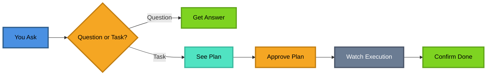

**For Questions**: You ask → You get an answer
**For Tasks**: You ask → See plan → Approve → Watch it happen → Confirm done

---

## The Two Paths

OpenAgent has two different ways of working, depending on what you need:

### Path 1: Conversational (For Questions)

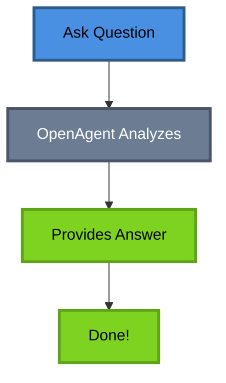

**When**: You ask informational questions
**Examples**:
- "What's the difference between REST and GraphQL?"
- "How do I use async/await in JavaScript?"
- "Explain what this code does"

**What Happens**: You get a direct, helpful answer. No approval needed.

---

### Path 2: Task Execution (For Actions)

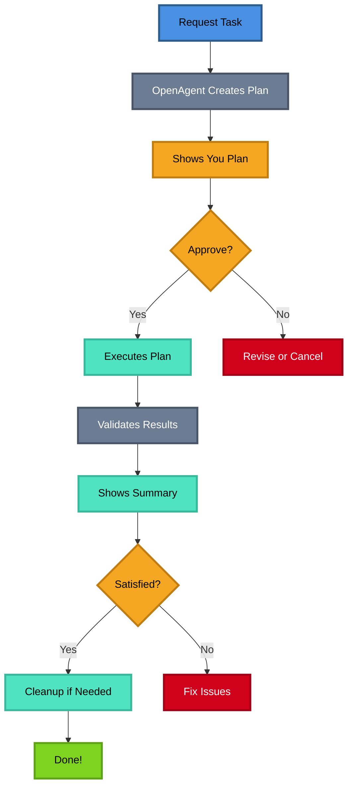

**When**: You want something done
**Examples**:
- "Create a README for this project"
- "Build a user authentication system"
- "Refactor this code to use TypeScript"

**What Happens**: 
1. You see a plan
2. You approve it
3. OpenAgent executes it
4. You confirm it's done right

---

## The 6-Stage Workflow

When you request a task, OpenAgent follows a systematic 6-stage workflow:

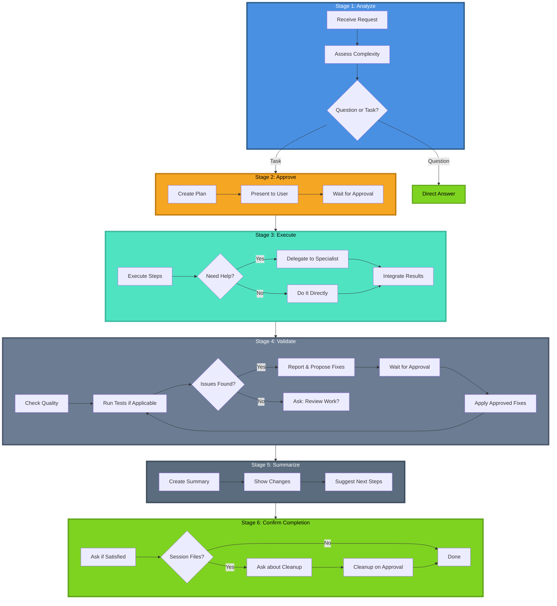

---

### Stage 1: Analyze

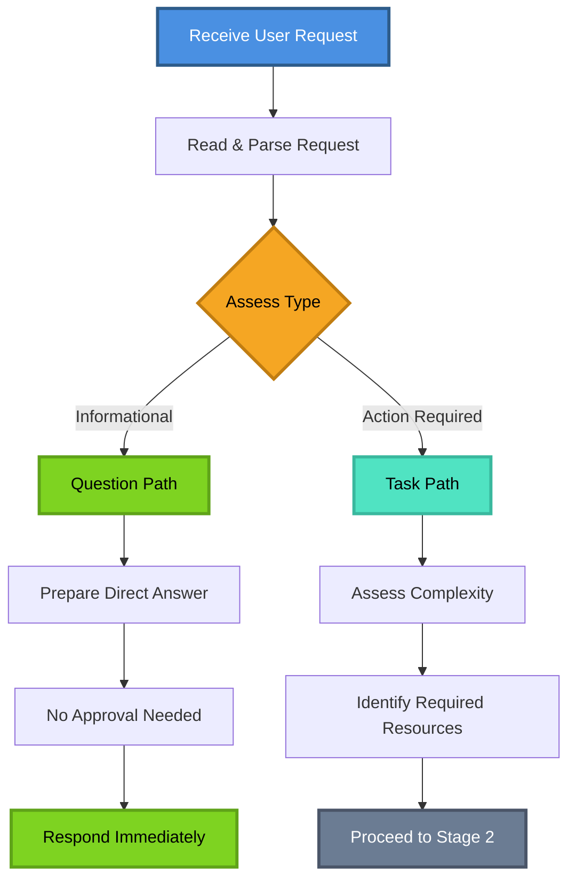

**What happens**: OpenAgent reads your request and decides if it's a question or a task.

**Your experience**: Instant - you don't see this happening.

---

### Stage 2: Approve ⚠️ (MANDATORY for tasks)

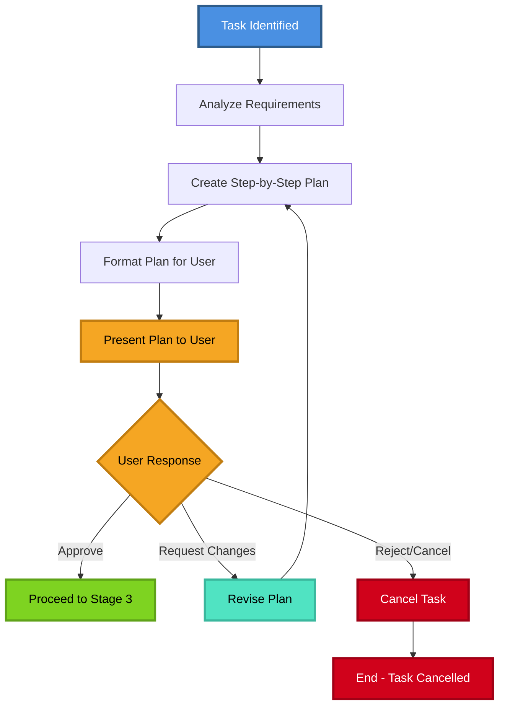

**What happens**: OpenAgent creates a plan and shows it to you.

**Your experience**: You see something like:
```
## Proposed Plan
1. Create README.md file
2. Add project overview section
3. Add installation instructions
4. Add usage examples

**Approval needed before proceeding.**
```

**What you do**: Review the plan and say "yes" or "no" (or ask for changes).

---

### Stage 3: Execute

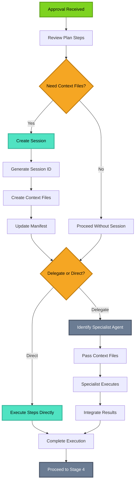

**What happens**: OpenAgent carries out the plan, either directly or by delegating to specialist agents.

**Your experience**: You might see:
- Files being created or modified
- Commands being run
- Progress updates
- Results from specialist agents

**Behind the scenes**: OpenAgent might create temporary files to preserve context between steps.

---

### Stage 4: Validate ⚠️ (MANDATORY for tasks)

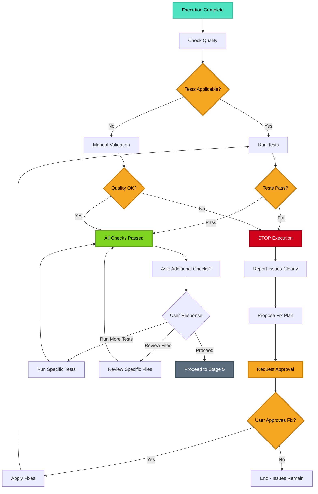

**What happens**: OpenAgent checks the quality of the work, runs tests if applicable, and ensures everything works correctly.

**Your experience when validation passes**: You see:
```
✅ Validation complete - all checks passed.

Would you like me to run any additional checks or review the work before I summarize?
- Run specific tests
- Check specific files  
- Review changes
- Proceed to summary
```

**What you do**: Choose to review further or proceed to summary.

#### Special Case: Test Failures or Issues Found

If OpenAgent runs tests or validation and finds issues, it follows a **strict protocol**:

**What happens**:
1. ⛔ **STOPS** execution immediately
2. 📋 **REPORTS** all issues/failures clearly
3. 📝 **PROPOSES** a fix plan with specific steps
4. ⚠️ **REQUESTS APPROVAL** before fixing (mandatory)
5. ✅ **PROCEEDS** only after you approve
6. 🔄 **RE-VALIDATES** after fixes are applied

**Your experience**: You see something like:
```
## Validation Results
❌ 3 tests failed:
- test_user_auth: Expected 200, got 401
- test_login: Missing token in response
- test_logout: Session not cleared

## Proposed Fix Plan
1. Update auth middleware to return proper status codes
2. Add token generation to login endpoint
3. Add session cleanup to logout handler

**Approval needed before proceeding with fixes.**
```

**Important**: OpenAgent will **NEVER** auto-fix issues without your explicit approval. After fixes are applied, validation runs again to ensure everything passes.

---

### Stage 5: Summarize

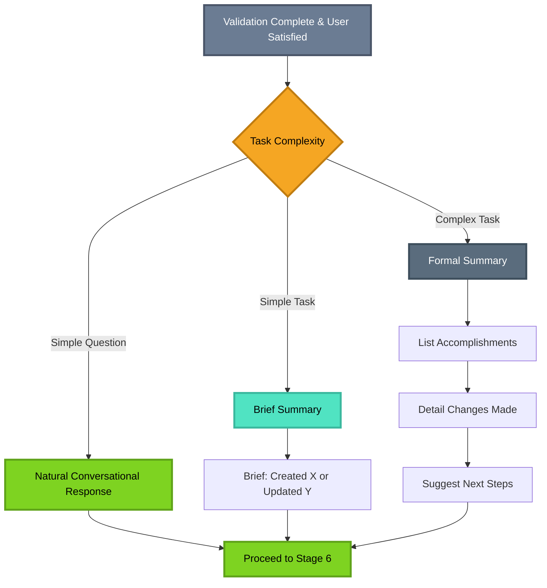

**What happens**: After validation passes and you're satisfied, OpenAgent creates a summary of what was accomplished.

**Your experience**: You see a summary like:
```
## Summary
Created README.md with project documentation.

**Changes Made:**
- Created README.md
- Added project overview
- Added installation guide
- Added usage examples

**Next Steps:** Review the README and update as needed.
```

---

### Stage 6: Confirm Completion ⚠️ (MANDATORY for tasks)

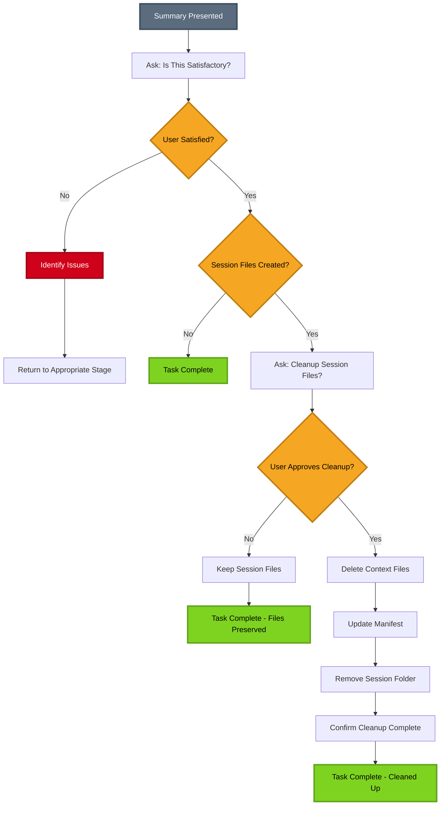

**What happens**: OpenAgent asks if you're satisfied and if temporary files should be cleaned up.

**Your experience**: You see:
```
Is this complete and satisfactory?
Should I clean up temporary session files at .tmp/sessions/20250118-143022-a4f2/?
```

**What you do**: Confirm you're happy with the results and approve cleanup if needed.

---

## Session Management

When OpenAgent works on complex tasks, it creates a **session** to keep track of everything.

### What is a Session?

A session is like a **temporary workspace** where OpenAgent stores:
- Context files (requirements, specifications)
- Task breakdowns
- Notes for specialist agents
- Progress tracking

### Session Structure

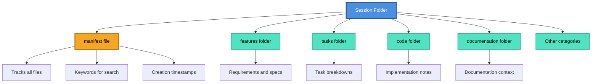

### Session Lifecycle

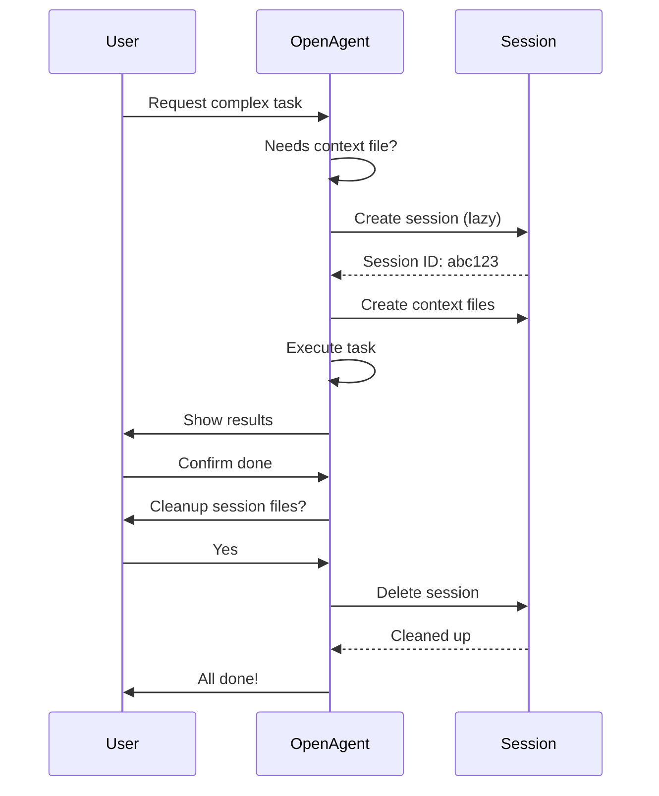

### Key Features

**Lazy Initialization**: Sessions are only created when actually needed (not for simple tasks).

**Unique IDs**: Each session gets a unique ID like `20250118-143022-a4f2` to prevent conflicts.

**Safe Cleanup**: OpenAgent only deletes files it created, and only after you approve.

**Concurrent Safety**: Multiple users can work simultaneously without interfering with each other.

---

## Dynamic Context Loading

One of OpenAgent's superpowers is **remembering context** across multiple steps.

### The Problem It Solves

Imagine this scenario:
1. You ask: "Build a user authentication system"
2. OpenAgent creates requirements and task breakdown
3. Later, you ask: "Implement the login component"

**Without context loading**: OpenAgent wouldn't remember the requirements from step 1.
**With context loading**: OpenAgent finds and uses the requirements automatically.

### How It Works

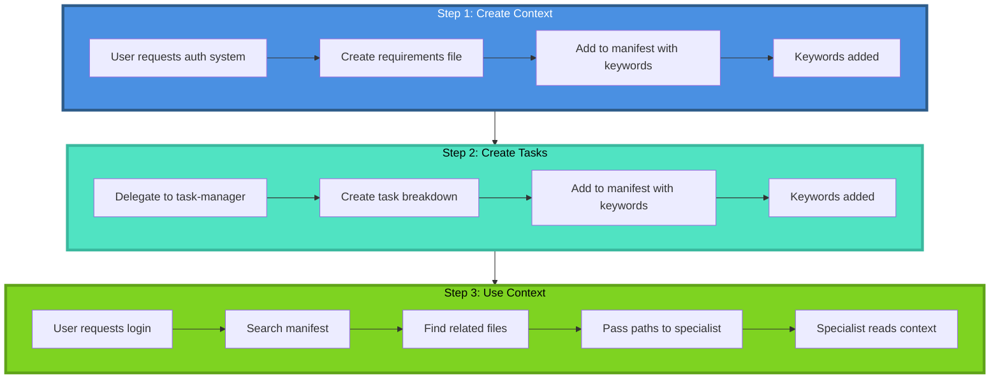

### The Manifest

The manifest is like an **index** that tracks all context files:

```json
{
  "session_id": "20250118-143022-a4f2",
  "context_files": {
    "features/user-auth-context.md": {
      "created": "2025-01-18T14:30:22Z",
      "for": "@task-manager",
      "keywords": ["user-auth", "authentication", "features"]
    },
    "tasks/user-auth-tasks.md": {
      "created": "2025-01-18T14:32:15Z",
      "for": "@task-manager",
      "keywords": ["user-auth", "tasks", "breakdown"]
    }
  },
  "context_index": {
    "user-auth": [
      "features/user-auth-context.md",
      "tasks/user-auth-tasks.md"
    ]
  }
}
```

**Benefits**:
- ✅ No context loss across steps
- ✅ Automatic discovery by keywords
- ✅ Flexible - only loads what's needed
- ✅ Traceable - you can see what context was used

---

## When OpenAgent Delegates

OpenAgent knows when to do work itself and when to call in specialists.

### Decision Tree

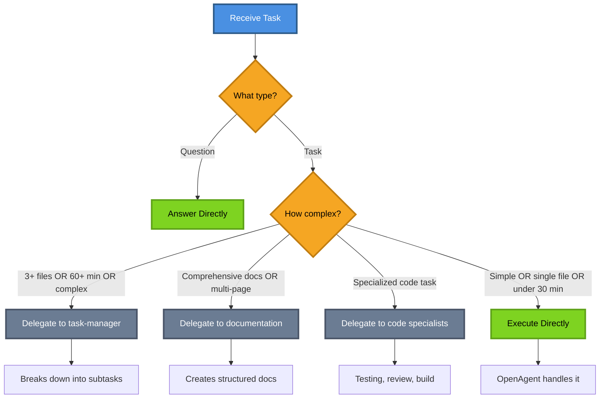

### Delegation Criteria

#### Delegate to @task-manager when:
- ✅ Feature spans **3+ files/modules**
- ✅ Estimated effort **>60 minutes**
- ✅ Needs **breakdown into subtasks**
- ✅ **Complex dependencies** between components
- ✅ User **explicitly requests** task breakdown

**Example**: "Build user authentication system"

---

#### Delegate to @documentation when:
- ✅ Creating **comprehensive docs** (API docs, guides, tutorials)
- ✅ **Multi-page** documentation
- ✅ Requires **codebase analysis/research**
- ✅ User **explicitly requests** documentation agent

**Example**: "Create API documentation for all endpoints"

---

#### Delegate to @code/* when:
- ✅ **Code-specific specialized task** (testing, review, build)
- ✅ Code subagents are **available** in current profile

**Examples**:
- "Review this code for security issues" → @code/reviewer
- "Write tests for this module" → @code/tester
- "Run build and fix errors" → @code/build-agent

---

#### Execute directly when:
- ✅ **Single file** operation
- ✅ **Simple, straightforward** task (<30 min)
- ✅ **Quick updates/edits**
- ✅ User **explicitly asks** openagent to handle it

**Examples**:
- "Create a README"
- "Update this function to use async/await"
- "Add a comment to this code"

---

## Visual Workflows

### Complete Task Workflow

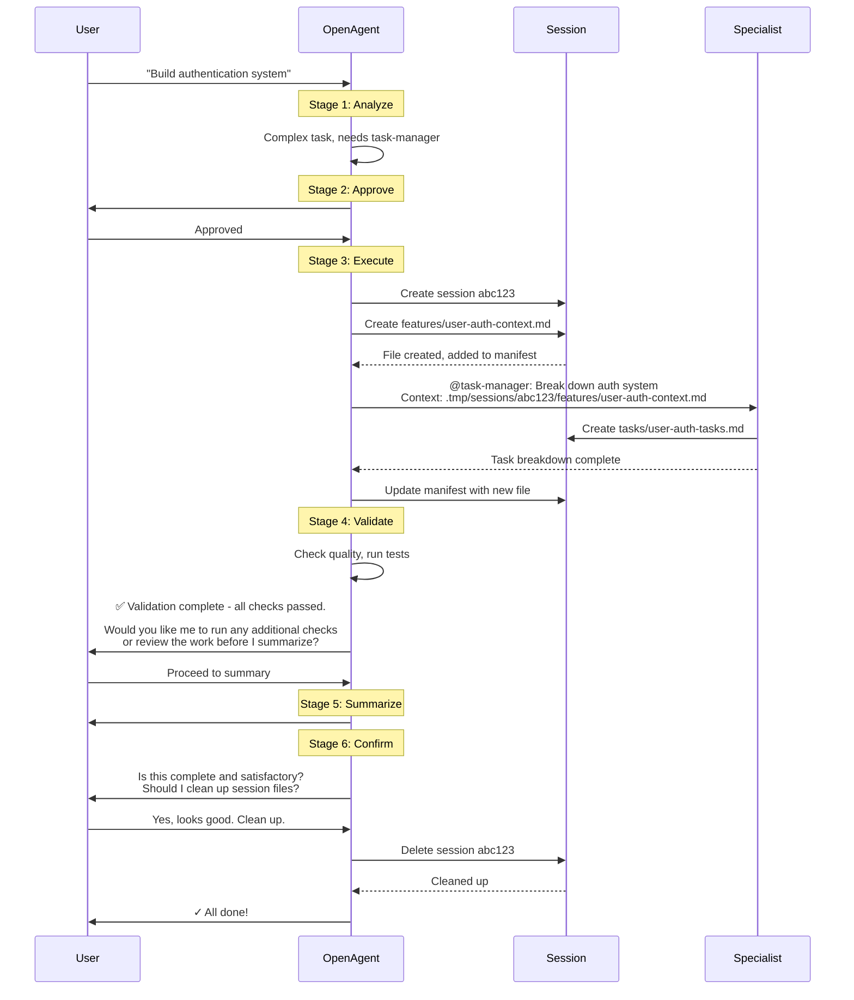

### Multi-Step with Context Preservation

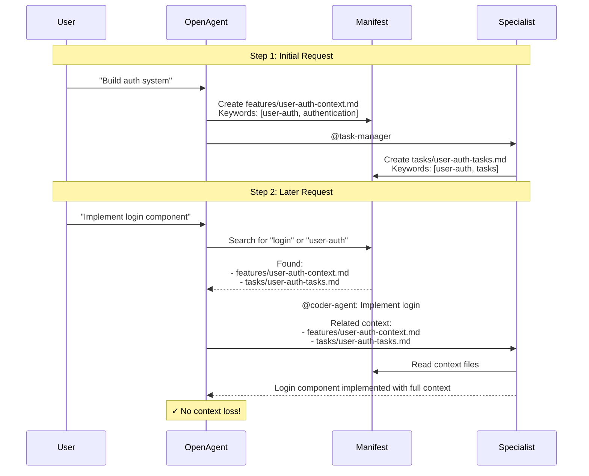

### Concurrent Sessions

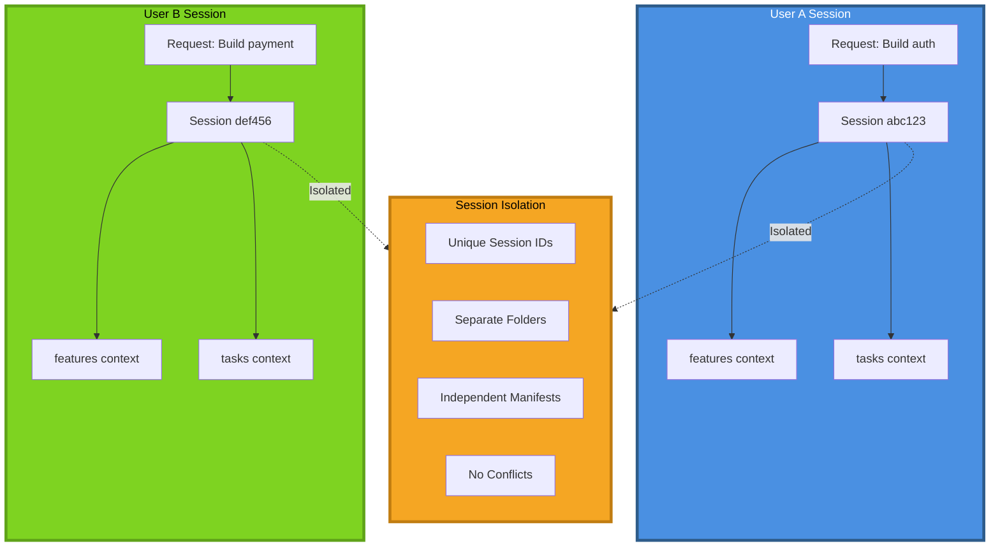

---

## Tips for Your Workflow

### 1. Be Specific in Your Requests

**Instead of**: "Make this better"
**Try**: "Refactor this function to use async/await and add error handling"

**Why**: Specific requests help OpenAgent create better plans and get approval faster.

---

### 2. Review Plans Carefully

When OpenAgent shows you a plan, take a moment to review it:
- ✅ Does it match what you want?
- ✅ Are there any steps you'd change?
- ✅ Is anything missing?

**Tip**: You can ask OpenAgent to revise the plan before approving.

---

### 3. Use Multi-Step Workflows

For complex projects, break them into steps:

```
Step 1: "Build user authentication system"
→ Review task breakdown

Step 2: "Implement the registration component"
→ OpenAgent uses context from Step 1

Step 3: "Implement the login component"
→ OpenAgent uses context from Steps 1 & 2
```

**Why**: OpenAgent preserves context across steps, making each step easier.

---

### 4. Leverage Specialist Agents

Let OpenAgent delegate to specialists:
- **Complex features** → Let task-manager break them down
- **Documentation** → Let documentation agent create comprehensive docs
- **Code review** → Let reviewer agent check for issues

**Tip**: You can explicitly request a specialist: "Use the documentation agent to create API docs"

---

### 5. Clean Up Sessions Regularly

After completing a workflow, approve session cleanup:
- ✅ Keeps your workspace clean
- ✅ Prevents accumulation of temporary files
- ✅ Frees up disk space

**Tip**: You can also manually clean up stale sessions:
```bash
./scripts/cleanup-stale-sessions.sh
```

---

### 6. Use Keywords Consistently

When working on related tasks, use consistent terminology:
- "user authentication" (not "auth" in one request and "login system" in another)
- "payment processing" (not "payments" and "checkout" interchangeably)

**Why**: Helps OpenAgent find related context files more easily.

---

### 7. Provide Context for Follow-Up Requests

When making follow-up requests, reference previous work:

**Good**: "Implement the login component from the auth system we planned earlier"
**Better**: "Implement the login component using the user-auth requirements"

**Why**: Helps OpenAgent search for the right context files.

---

### 8. Customize Delegation Thresholds

You can adjust when OpenAgent delegates by modifying the criteria in `.opencode/agent/openagent.md`:

**Current defaults**:
- 3+ files → Delegate to task-manager
- >60 minutes → Delegate to task-manager
- <30 minutes → Execute directly

**To customize**: Edit the `<delegation_criteria>` section to match your preferences.

---

### 9. Create Your Own Categories

The default categories are:
- features, documentation, code, refactoring, testing, tasks, general

**To add custom categories**: Edit the `<categories>` line in openagent.md:
```xml
<categories>features | documentation | code | refactoring | testing | general | tasks | your-category</categories>
```

**Use case**: If you frequently work on "migrations" or "integrations", add those as categories.

---

### 10. Monitor Session Files

Occasionally check `.tmp/sessions/` to see what context is being preserved:

```bash
ls -la .tmp/sessions/
```

**Why**: Helps you understand what context OpenAgent is using and identify any issues.

---

### 11. Use Explicit Approvals for Learning

When learning a new codebase or technology, use OpenAgent's approval step as a learning opportunity:
- Read the plan carefully
- Ask questions about steps you don't understand
- Request explanations before approving

**Example**:
```
OpenAgent: "I'll refactor this to use dependency injection"
You: "What is dependency injection and why is it better here?"
OpenAgent: [Explains]
You: "Got it, approved!"
```

---

### 12. Combine with Other Agents

OpenAgent works great with other agents in your profile:
- Use OpenAgent for planning and coordination
- Let specialists handle their domains
- OpenAgent will preserve context between them

**Example workflow**:
1. OpenAgent plans the feature
2. @coder-agent implements it
3. @tester writes tests
4. @reviewer checks quality
5. @documentation documents it

All coordinated by OpenAgent with preserved context!

---

## Advanced Tips

### Create Reusable Context Templates

For recurring workflows, create context templates:

**Example**: `.opencode/templates/feature-context.md`
```markdown
# Feature: {FEATURE_NAME}

## Requirements
- [List requirements]

## Constraints
- [List constraints]

## Success Criteria
- [List criteria]
```

**Use**: "Create a new feature using the feature-context template"

---

### Use Session IDs for Debugging

If something goes wrong, note the session ID:
```
Session: 20250118-143022-a4f2
```

You can inspect the session folder to see what context was created:
```bash
cat .tmp/sessions/20250118-143022-a4f2/.manifest.json
```

---

### Batch Related Tasks

Group related tasks in one session for better context:

**Instead of**:
- Request 1: "Create user model"
- Request 2: "Create auth controller"
- Request 3: "Create login route"

**Try**:
- Request: "Build user authentication with model, controller, and routes"

**Why**: Single session, all context preserved, more efficient.

---

## Core Principles

OpenAgent follows these core principles:

### 🎯 Lean
Concise responses, no over-explanation. Gets to the point quickly.

### 🔄 Adaptive
Conversational for questions, formal for tasks. Matches the context.

### ⚡ Lazy
Only creates sessions/files when actually needed. No unnecessary overhead.

### 🔒 Safe
**ALWAYS** requests approval before ANY execution. Confirms before cleanup.

### 📋 Report First
When tests fail or issues are found:
1. **REPORT** the issues
2. **PLAN** the fixes
3. **REQUEST APPROVAL**
4. **FIX** (only after approval)

**Never auto-fixes** - you're always in control.

---

## Summary

OpenAgent is your **intelligent project manager** that:

✅ **Plans before acting** - Shows you the plan and waits for approval
✅ **Preserves context** - Remembers information across multiple steps
✅ **Delegates wisely** - Calls in specialists when needed
✅ **Keeps you in control** - Always confirms before cleanup
✅ **Handles complexity** - Breaks down big tasks into manageable pieces
✅ **Reports before fixing** - Never auto-fixes issues without approval

**Key Takeaways**:
1. Be specific in your requests
2. Review plans before approving
3. Use multi-step workflows for complex projects
4. Let OpenAgent delegate to specialists
5. Clean up sessions when done
6. Customize to fit your workflow
7. Expect reports before fixes when issues are found

**Ready to get started?** Just ask OpenAgent a question or request a task!

---

## Configuration

OpenAgent is configured in `.opencode/agent/openagent.md`. You can customize:
- Delegation thresholds
- Categories
- Error handling
- Test failure protocol
- And more!

Happy building! 🚀
